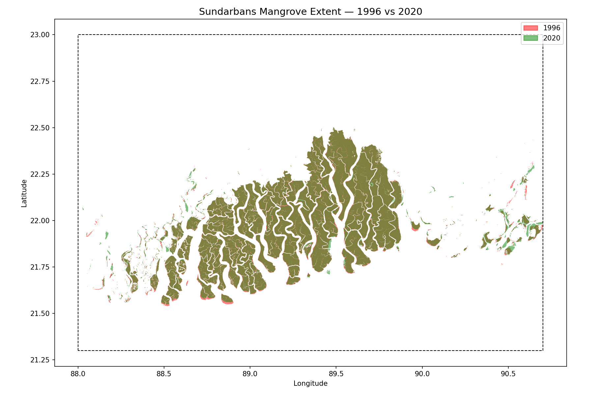
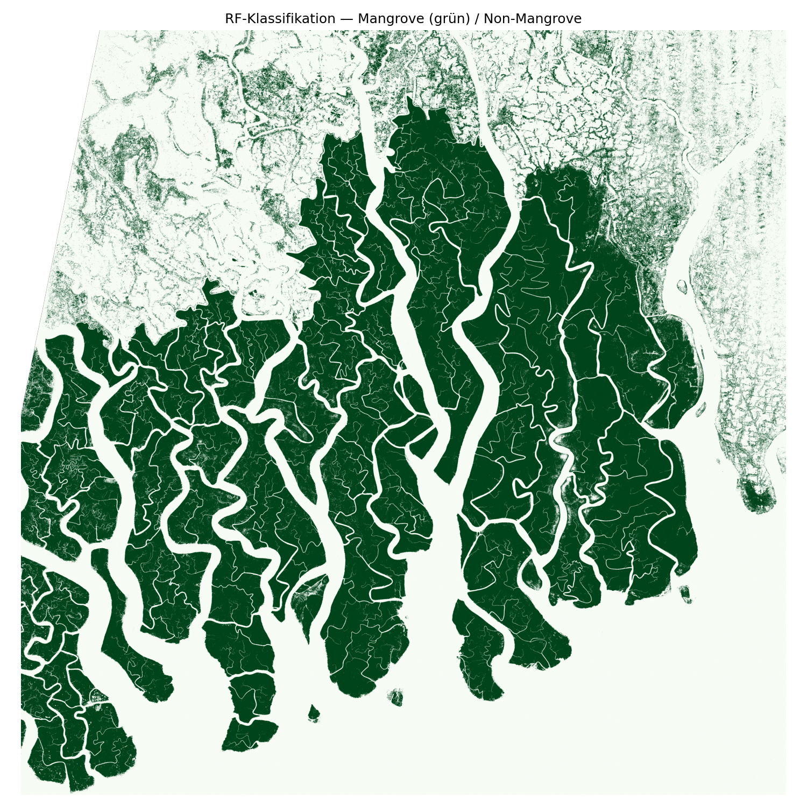
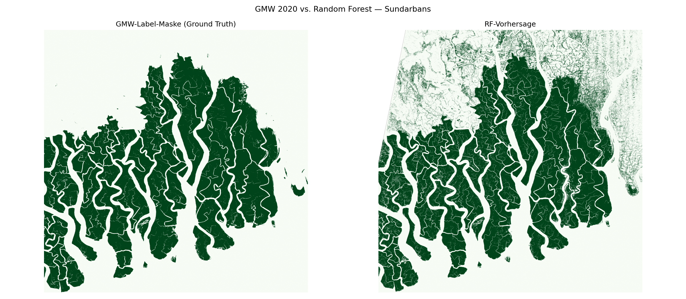

# Mangroven-Loss-Tracker

Interactive web app visualizing mangrove loss 1996–2020 for the Sundarbans (Bangladesh/India), including carbon impact estimates.


**Live demo:** *(coming soon — Streamlit Community Cloud)*

---

## What this project does

- Loads Global Mangrove Watch v3 (GMW v3) shapefiles and clips them to a hotspot bounding box
- Calculates mangrove area loss between 1996 and 2020 using an equal-area projection (EPSG:6933)
- Estimates carbon loss in tonnes CO₂e and monetary value based on Blue Carbon market prices
- Visualizes both extents as a static matplotlib map and an interactive leafmap (folium) map
- Presents all results in a Streamlit web app with sidebar, metric panels, and embedded map

---

## Results — Sundarbans

| Metric | Value |
|--------|-------|
| Mangrove extent 1996 | 6,313 km² |
| Mangrove extent 2020 | 6,293 km² |
| Net loss 1996–2020 | 20.1 km² |
| Carbon loss | ~2,006,150 t CO₂e |
| Market value (@ $30/t) | ~$60,184,505 |

*Note: net loss is smaller than raw numbers suggest because the eastern Bangladesh portion shows net mangrove gain (active restoration programs), partially offsetting losses in the west.*

---

## Screenshots

**Streamlit App**


---

## Tech stack

| Tool | Purpose |
|------|---------|
| `geopandas` | Load and clip GMW v3 shapefiles |
| `rioxarray` + `xarray` | Raster data handling (future steps) |
| `leafmap` (foliumap) | Interactive map rendering |
| `matplotlib` | Static map export |
| `streamlit` | Web app frontend |
| `plotly` | Charts (future steps) |
| `pystac-client` + `planetary-computer` | Sentinel-2 access (future steps) |

---

## Data sources

- **Global Mangrove Watch v3** — Bunting et al. 2022, [Zenodo](https://zenodo.org/record/6894273), CC BY 4.0
- **Carbon density** — Sanderman et al. 2018, ~1,000 t CO₂e/ha
- **Blue Carbon price** — Voluntary Carbon Market, ~$30/t CO₂e

---

## Setup

```bash
python -m venv .venv
.venv\Scripts\activate        # Windows
pip install -r requirements.txt
streamlit run app.py
```

**Note:** Raw data files (`data/raw/`) are not included in this repo. Download GMW v3 shapefiles from Zenodo and place them in `data/raw/gmw_v3_1996/` and `data/raw/gmw_v3_2020/`.

---

## Notebook 03 — Multispectral ML

`notebooks/03_sundarbans_Multispectral_STAC_ML.ipynb` extends the analysis from vector-based loss statistics to pixel-level classification. It queries the Microsoft Planetary Computer STAC API for a Sentinel-2 L2A scene over the Sundarbans bounding box, selects the scene with highest GMW polygon overlap (not just lowest cloud cover), and downloads four spectral bands (B02, B03, B04, B08) at 10 m native resolution.

The classification pipeline resamples all bands to 20 m, computes NDVI as a fifth feature, burns GMW 2020 polygons into a pixel label mask via `rasterio.features.rasterize`, draws a balanced training sample of 50,000 pixels per class, and trains a Random Forest (50 trees, max depth 15, `class_weight="balanced"`) on the resulting feature matrix. Final accuracy on the held-out validation set is **92%** for both Mangrove and Non-Mangrove classes.

Key limitations: training labels come from the GMW 2020 vector dataset, which has its own mapping uncertainty; the Sentinel-2 scene is from November 2020, so temporal generalization (other seasons, other years) is untested; no hyperparameter tuning was performed — this is a prototype. The 38% Mangrove pixel fraction in the selected tile (T45QYE) is unusually high because the tile was chosen for maximum GMW overlap, so class imbalance effects were minimal in this run.





---

## Project structure

```
mangroven-tracker/
├── app.py                  # Streamlit entry point
├── requirements.txt
├── notebooks/
│   └── 02_sundarbans_loss.ipynb   # Loss stats + visualisation + carbon calc
├── src/                    # Reusable modules (in progress)
├── data/
│   ├── raw/                # GMW v3 shapefiles (not tracked)
│   └── processed/          # Clipped hotspot data
└── assets/precomputed/     # Exported maps and stats
```
